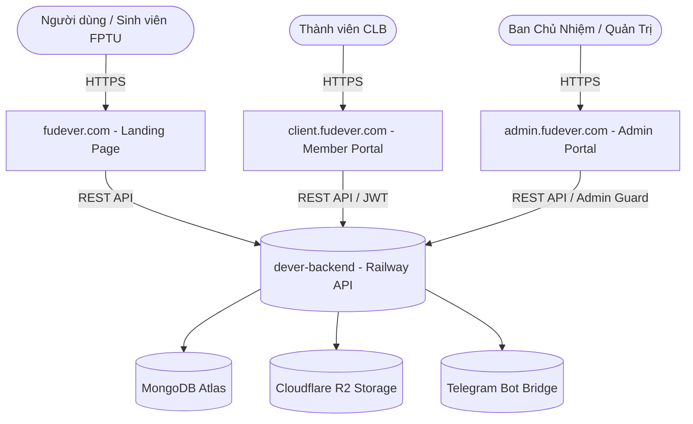

# 🚀 FU-DEVER Landing Page & Tech Showcase

<p align="center">
  
</p>

<p align="center">
  <b>Cổng thông tin & Trưng bày công nghệ chính thức của Câu lạc bộ Lập trình FU-DEVER</b><br />
  <i>Đại học FPT Đà Nẵng · "WORK HARD - PLAY HARD"</i>
</p>

<p align="center">
  <a href="https://fudever.com"></a>
  <a href="https://github.com/fudever-club/fu-dever-landingpage"></a>
  
  
  
  
</p>

---

## 🌐 Hệ Sinh Thái FU-DEVER (Ecosystem Architecture)

| Phân hệ (Platform) | Tên miền chính thức | Repository GitHub | Mục đích & Chức năng |
| :--- | :--- | :--- | :--- |
| **Landing Page Showcase** | [fudever.com](https://fudever.com) | [fu-dever-landingpage](https://github.com/fudever-club/fu-dever-landingpage) | Giới thiệu CLB, Sự kiện, Bảng vàng danh dự, Bài viết kỹ thuật, Project Lab |
| **Member & Client Portal** | [client.fudever.com](https://client.fudever.com) | [dever-client](https://github.com/fudever-club/dever-client) | Cổng thành viên, Đấu trường LeetCode, Soạn thảo DEVER Studio Blog, Hồ sơ |
| **Admin Command Dashboard**| [admin.fudever.com](https://admin.fudever.com) | [dever-admin](https://github.com/fudever-club/dever-admin) | Quản trị thành viên, Phê duyệt Tech Blog, Quản lý Sự kiện & Kho tài nguyên |
| **Backend API Gateway** | [Railway Cloud](https://dever-backend-production.up.railway.app/health) | [dever-backend](https://github.com/fudever-club/dever-backend) | REST API, MongoDB Atlas, Cloudflare R2 Storage, Telegram Bot (@Fudever_bot) |



---

## ✨ Tính Năng Nổi Bật (Key Features)

- 🎟️ **DeverEventHero 3D Holographic VIP Ticket:** Trực quan hóa vé sự kiện công nghệ, lọc đa trạng thái (Đang mở đăng ký, Đang diễn ra, Sắp diễn ra) và đăng ký nhanh qua Google Form đã được làm sạch URL an toàn.
- 🏆 **Bảng Vàng Danh Dự (Hall of Fame):** Tôn vinh Top 3 chiến binh lập trình trên bục Podium 3D (Quán Quân, Á Quân, Quý Quân) và hệ thống 5 Huy hiệu thành tích 3D (Algorithmic Prodigy, Pro Tech Author, Speed Coder, Core Contributor, Security Sentinel).
- 💻 **Project Lab & Ghép Đội (Matchmaking):** Kết nối ý tưởng đồ án, tìm đồng đội làm sản phẩm thực tế kèm hiệu ứng Terminal tương tác.
- 📚 **DEVER Tech Blog Reader:** Trình đọc bài viết Markdown chuyên nghiệp hỗ trợ Callouts (`[!NOTE]`, `[!TIP]`, `[!WARNING]`, `[!CAUTION]`), sơ đồ Mermaid và highlight cú pháp đa ngôn ngữ.
- ⚡ **Command Palette (⌘K / Ctrl+K):** Tìm kiếm tức thì toàn bộ bài viết, sự kiện, thành viên và tài nguyên học thuật FPTU.

---

## 🎨 Quy Chuẩn Thiết Kế (UI/UX Design Standards)

- **Màu sắc nhận diện thương hiệu:** Primary `#0066CC` (Royal Blue), Dark Variant `#004C99`, Light Accent `#0080FF`.
- **Hệ thống 5 trạng thái UX:** Xử lý triệt để `Empty State`, `Loading Skeleton`, `Success Toast`, `Error State with Retry`, `Disabled State`.
- **Tiêu chuẩn No-AI Asset:** 100% sử dụng hình ảnh thực tế CLB và Code Component / SVG Vector Canvas thuần khiết.
- **Khả năng tiếp cận (Accessibility):** Hỗ trợ phím tắt `ESC` đóng Modal, đạt chuẩn tương phản WCAG 2.1 AAA.

---

## 💻 Cài Đặt & Chạy Cục Bộ (Local Development)

### Yêu cầu:
- Node.js 20+ và npm / yarn / pnpm
- Dịch vụ Backend đang chạy trên cổng `5000` (hoặc kết nối Railway)

### 1. Cài đặt dependencies:
```bash
git clone https://github.com/fudever-club/fu-dever-landingpage.git
cd fu-dever-landingpage
npm ci
```

### 2. Cấu hình biến môi trường:
Tạo file `.env.local` tại thư mục gốc:
```env
NEXT_PUBLIC_API_SERVER=http://localhost:5000
NEXT_PUBLIC_LANDING_URL=http://localhost:3000
NEXT_PUBLIC_CLIENT_URL=http://localhost:3002
NEXT_PUBLIC_ADMIN_URL=http://localhost:3003
```

### 3. Khởi chạy máy chủ phát triển:
```bash
npm run dev -- -p 3000
```
Truy cập ứng dụng tại: `http://localhost:3000`

---

## 🧪 Kiểm Thử & Đóng Gói (Quality Checks)

```bash
# Kiểm tra TypeScript và Linting
npm run lint

# Đóng gói Production Bundle
npm run build
```

---

## 📄 Bản Quyền & Giấy Phép (License)

Dự án được phát triển và duy trì bởi **Ban Kỹ Thuật Câu lạc bộ Lập trình FU-DEVER** - Đại học FPT Đà Nẵng.  
Phát hành theo giấy phép [MIT License](LICENSE).
